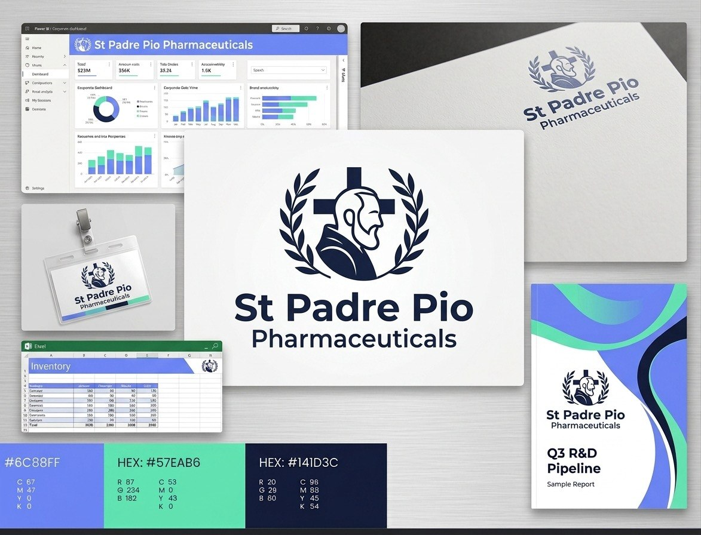
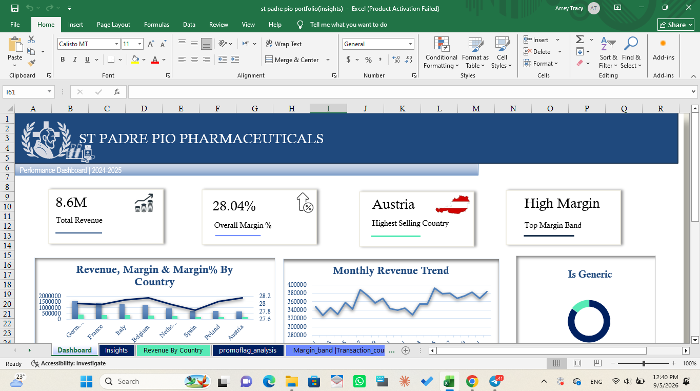
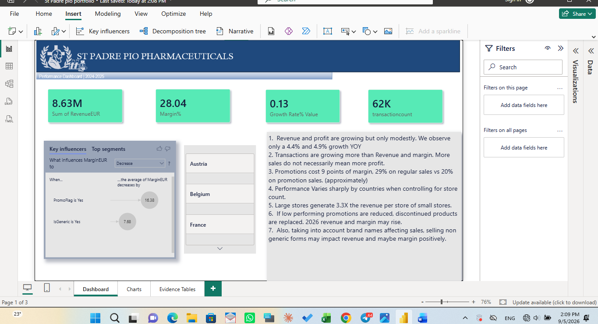

# St Padre Pio Pharma — Retail Sales Performance Analysis

SQL, Excel, and Power BI analysis diagnosing flat revenue growth for a pharmacy retail chain operating across 8 European countries, using a two-year star-schema sales dataset.

St Padre Pio Pharma is a fictional company created entirely for this portfolio — the name, logo, brand identity, and color palette were all designed to create an identity for this project.

| Color | Hex |
|---|---|
| Periwinkle | #6C88FE |
| Mint | #57EAB6 |
| Navy | #141D3C |

## Business Problem

Revenue and profit had grown only modestly year-over-year despite the store network expanding from 109 to 120 pharmacies. This project investigates *why* growth stalled, using SQL for exploratory analysis, Excel for a summary dashboard, and Power BI for an interactive, scenario-driven dashboard.

## Data Model

Star schema with four tables:
- FactSales — transaction-level sales (revenue, cost, margin, units, promo flag)
- DimDate, DimPharmacy, DimProduct — supporting dimensions (country, store size, product category, discontinued status)

## Key Findings

1. Flat revenue was actually two offsetting trends. Revenue from products that stayed active the whole period grew ~1.3% per month. Revenue from 35 discontinued products decayed from ~€65K/month to €0 as they were phased out without replacement — cancelling out the real growth.
2. Promotions cost margin with no volume benefit. Promotional transactions (~12% of orders) ran at ~19.6–19.9% margin vs. ~29.0% on regular-priced transactions.
3. Store size and location drive revenue, not margin. Large stores generate ~3.3× the revenue per store of small stores, and revenue per store varies ~60% by country — but margin % holds steady at ~28% almost everywhere.

## Solutions Proposed

1. Refresh the product catalog — prioritize replacing discontinued SKUs, starting with Medical Devices and Personal Care.
2. Redesign the promotion strategy — shift from blanket discounts to targeted promotions with a minimum volume-lift threshold.

## SQL Analysis

Exploratory analysis run in DB Browser for SQLite.

## Excel Dashboard

KPI summary dashboard covering revenue, margin, and inventory trends.

📄 [Download the Excel workbook]('assests/St Padre pio portfolio.pbix')

## Power BI Dashboard

Interactive dashboard with DAX measures and a What-If scenario forecast modeling the proposed solutions above.

📊 [Download the Power BI file](st-padrepio-powerbi-file.pbix)

## Author

Arrey Tracy — 5th year of 7years pharmacy doctoral Student, transitioning into data analytics, focused on health-sector data roles.
